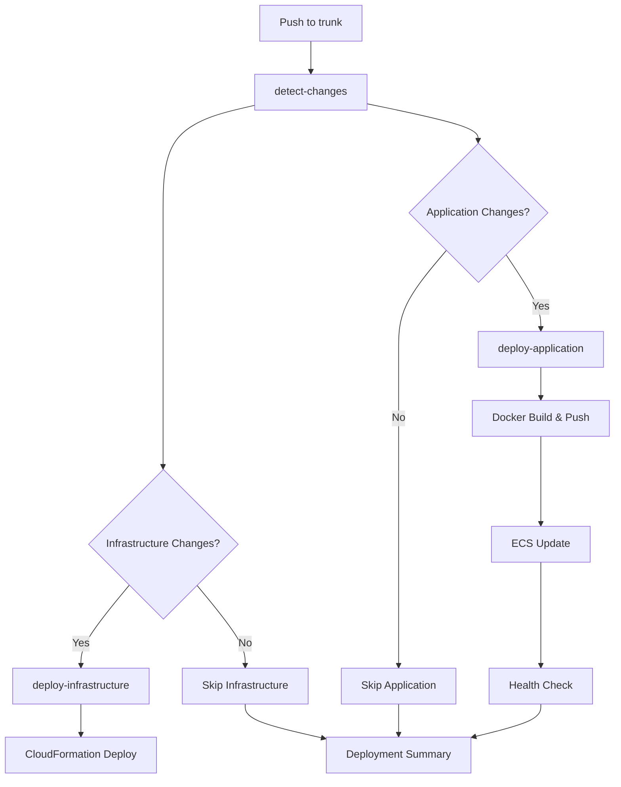

# GitHub Actions Workflows

This repository includes automated CI/CD workflows for deploying the BRM application to AWS.

## Workflows

### 1. `deploy.yml` - Automatic Deployment
**Trigger:** Push to `trunk` branch

**Features:**
- 🔍 **Smart Change Detection**: Only deploys components that have changed
- 🏗️ **Infrastructure**: Deploys CloudFormation when `cloudformation/*.yaml` files change
- 🚀 **Application**: Builds and deploys Docker image when `src/`, `server/`, `package.json`, or `Dockerfile` change
- 🔄 **Force Deploy**: Always deploys application on pushes to trunk (configurable)

**Jobs:**
1. **detect-changes** - Analyzes git diff to determine what changed
2. **deploy-infrastructure** - Updates CloudFormation stack (conditional)
3. **deploy-application** - Builds Docker image and updates ECS service (conditional)
4. **notify-deployment** - Creates deployment summary

### 2. `manual-deploy.yml` - Manual Deployment
**Trigger:** Manual dispatch through GitHub UI

**Features:**
- 🎛️ **Manual Control**: Choose what to deploy via GitHub Actions UI
- 🌍 **Environment Selection**: Deploy to production or staging
- 🏥 **Health Checks**: Automated health endpoint testing after deployment

**Options:**
- ☑️ Deploy Infrastructure (CloudFormation)
- ☑️ Deploy Application (Docker + ECS) 
- 🎯 Environment (production/staging)

## Required Secrets & Variables

Configure these in your GitHub repository settings:

**Secrets:**
```
AWS_ACCESS_KEY_ID     - AWS access key for deployment
AWS_SECRET_ACCESS_KEY - AWS secret key for deployment  
DB_PASSWORD           - Database password
JWT_SECRET            - JWT secret for authentication
```

**Variables:**
```
DB_HOST               - Database host (RDS endpoint)
DB_PORT               - Database port (5432)
DB_NAME               - Database name
DB_USER               - Database username
JWT_EXPIRES_IN        - JWT expiration time (7d)
```

**IAM Permissions Required:**
- CloudFormation: Full access to create/update stacks
- ECS: Update services, describe clusters/services
- ECR: Push images, get login token
- Logs: Read CloudWatch logs

## Configuration

### Environment Variables (in workflows)
```yaml
AWS_REGION: sa-east-1
APP_NAME: brm-app  
ENVIRONMENT: production
ECR_REPOSITORY: 062721086100.dkr.ecr.sa-east-1.amazonaws.com/brm-app-production
```

### Deployment Flow

#### Automatic (on push to trunk):
1. **Change Detection**: Git diff analysis
2. **Infrastructure**: Deploy if CloudFormation templates changed
3. **Application**: Build→Push→Deploy if app code changed
4. **Notification**: Summary of what was deployed

#### Manual (via GitHub UI):
1. **Select Options**: Infrastructure and/or Application
2. **Choose Environment**: production or staging  
3. **Deploy**: Execute selected deployments
4. **Verify**: Health check validation

## Usage

### Automatic Deployment
Just push to the `trunk` branch:
```bash
git push origin trunk
```

### Manual Deployment
1. Go to **Actions** tab in GitHub
2. Select **Manual Deployment** workflow
3. Click **Run workflow**
4. Choose your options:
   - ☑️ Deploy infrastructure
   - ☑️ Deploy application  
   - 🎯 Environment: production
5. Click **Run workflow**

## Monitoring

### Deployment Status
- ✅ **Success**: Green checkmark, application URL in summary
- ❌ **Failure**: Red X, check logs for details
- ⏳ **In Progress**: Yellow circle, deployment running

### Health Checks
After deployment, workflows automatically test:
- 🏥 Health endpoint: `/health`
- 📊 Application status
- 🔍 ECS service stability

### Quick Links (Post-Deployment)
- 🌐 Application: http://brm-app-production-alb-1432108016.us-east-1.elb.amazonaws.com
- 🏥 Health Check: http://brm-app-production-alb-1432108016.us-east-1.elb.amazonaws.com/health

## Troubleshooting

### Common Issues

**1. AWS Credentials**
```
Error: The security token included in the request is invalid
```
→ Check AWS_ACCESS_KEY_ID and AWS_SECRET_ACCESS_KEY secrets

**2. ECR Push Failed**
```
Error: denied: requested access to the resource is denied
```
→ Ensure ECR repository exists and IAM has ECR permissions

**3. ECS Update Failed**
```
Error: Cluster/Service not found
```
→ Deploy infrastructure first, then application

**4. Health Check Failed**
```
Error: Health endpoint returned 5xx
```
→ Check application logs, verify Docker health check

### Manual Intervention
If automated deployment fails:

```bash
# Check stack status
aws cloudformation describe-stacks --stack-name brm-app-production

# Check ECS service
aws ecs describe-services --cluster brm-app-production-cluster --services brm-app-production-service

# Manual ECS update
aws ecs update-service --cluster brm-app-production-cluster --service brm-app-production-service --force-new-deployment

# Check logs
aws logs tail /ecs/brm-app-production --follow
```

## Architecture



This setup ensures reliable, automated deployments with proper change detection and health validation.