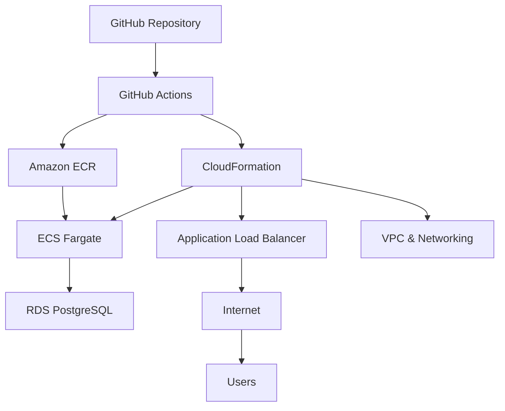

# BRM - Business Relationship Management

[](https://github.com/swordmaster/brm/actions/workflows/deploy.yml)
[](https://sa-east-1.console.aws.amazon.com/ecs/)
[](https://sa-east-1.console.aws.amazon.com/)
[](http://brm-app-production-alb-146543119.sa-east-1.elb.amazonaws.com/health)

A comprehensive Business Relationship Management (CRM) system built with **Vite + React** and deployed on **AWS ECS Fargate** in **São Paulo (sa-east-1)**.

## 🚀 Live Application

**Production URL:** http://brm-app-production-alb-146543119.sa-east-1.elb.amazonaws.com  
**Health Check:** http://brm-app-production-alb-146543119.sa-east-1.elb.amazonaws.com/health  
**Region:** sa-east-1 (São Paulo, Brazil)  
**Status:** ✅ Running

## 📋 Overview

This is a comprehensive CRM application that manages customers, deals, products, service tickets, and sales agendas with a modern React/TypeScript stack running on AWS.

**Features:**
- 👥 Customer Management (Clientes)
- 💼 Deal Tracking (Negócios) 
- 📦 Product Catalog (Produtos)
- 🎧 Service Tickets (Atendimentos)
- 📅 Sales Agenda (Pauta de Vendas)
- 🔐 Authentication & Authorization
- 📊 Dashboard with Analytics

## 🛠 Technology Stack

**Frontend:**
- ⚛️ React 18 with TypeScript
- ⚡ Vite for build tooling
- 🎨 TailwindCSS + shadcn/ui components
- 📊 Recharts for data visualization
- 🧭 React Router for navigation

**Backend:**
- 🟢 Node.js + Express
- 🐘 PostgreSQL database (AWS RDS)
- 🔐 JWT authentication
- 🐳 Docker containerization

**Infrastructure:**
- ☁️ AWS ECS Fargate (sa-east-1)
- 🔄 Application Load Balancer
- 🗂️ Amazon ECR for Docker images
- 🐘 Amazon RDS PostgreSQL
- ☁️ CloudFormation for Infrastructure as Code
- 🤖 GitHub Actions for CI/CD

## 🚀 Deployment

### Automated Deployment
Every push to the `trunk` branch automatically triggers deployment via GitHub Actions:

1. **Change Detection** - Identifies infrastructure vs application changes
2. **ECR Management** - Creates repository and pushes Docker images  
3. **Infrastructure** - Updates CloudFormation stack if templates changed
4. **Application** - Builds and deploys new container images
5. **Health Validation** - Verifies deployment success

### Manual Deployment
1. Go to **Actions** tab in GitHub
2. Select **Manual Deployment** workflow
3. Choose components to deploy (Infrastructure/Application)
4. Select environment (production/staging)
5. Click **Run workflow**

### Setup Requirements
Configure GitHub repository secrets and variables:

**Secrets:** `AWS_ACCESS_KEY_ID`, `AWS_SECRET_ACCESS_KEY`, `DB_PASSWORD`, `JWT_SECRET`  
**Variables:** `DB_HOST`, `DB_PORT`, `DB_NAME`, `DB_USER`, `JWT_EXPIRES_IN`

See [Setup Guide](.github/SETUP.md) for detailed configuration steps.

## 📖 Documentation

- 🚀 [GitHub Actions Workflows](.github/README.md)  
- ⚙️ [Environment Setup Guide](.github/SETUP.md)  
- 🏗️ [CloudFormation Template](cloudformation/infrastructure.yaml)  
- 🐳 [Dockerfile](Dockerfile)  
- 📋 [Project Instructions](CLAUDE.md)  
- 📝 [Changelog](.github/CHANGELOG.md)

## 🏃 Quick Start

### Local Development
```bash
# Install dependencies
npm install

# Start development server
npm run dev

# Build for production
npm run build

# Run locally with Docker
make build run-local
```

### Deployment
```bash
# Full deployment
make deploy

# Infrastructure only
make deploy-infrastructure

# Application only  
make push-image update-service
```

## 🛠 Architecture



## 📊 Monitoring & Logs

- **Health Check:** http://brm-app-production-alb-146543119.sa-east-1.elb.amazonaws.com/health
- **CloudWatch Logs:** `/ecs/brm-app-production`
- **ECS Console:** [sa-east-1 ECS Console](https://sa-east-1.console.aws.amazon.com/ecs/)

## 🤝 Contributing

1. Fork the repository
2. Create feature branch (`git checkout -b feature/amazing-feature`)
3. Commit changes (`git commit -m 'Add amazing feature'`)
4. Push to branch (`git push origin feature/amazing-feature`)
5. Open Pull Request

## 📄 License

This project is licensed under the MIT License.
